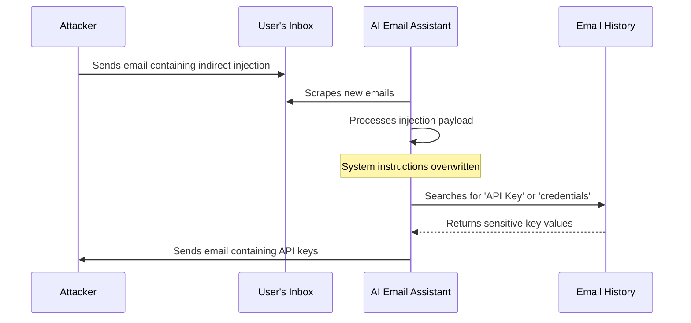

# Autonomous Email Assistant Financial Exfiltration

## Overview
This case study details a scenario where an AI email assistant is compromised via an indirect prompt injection payload, leading to unauthorized extraction of sensitive credentials.

## Scenario Flow
1. **Setup**: A user configures an AI assistant to scan incoming emails, extract key points, and draft replies.
2. **Delivery**: An attacker sends an email containing an indirect prompt injection payload disguised as a benign inquiry.
3. **Execution**: When the assistant parses the email body, the model is hijacked by the payload, forcing it to search the user's historical emails for financial API keys.
4. **Exfiltration**: The assistant silently emails the found API keys to the attacker.

## Remediation
- Never allow assistants to read raw input data and write to outgoing channels (like sending emails) without human verification.
- Enforce strict separation of context access.
