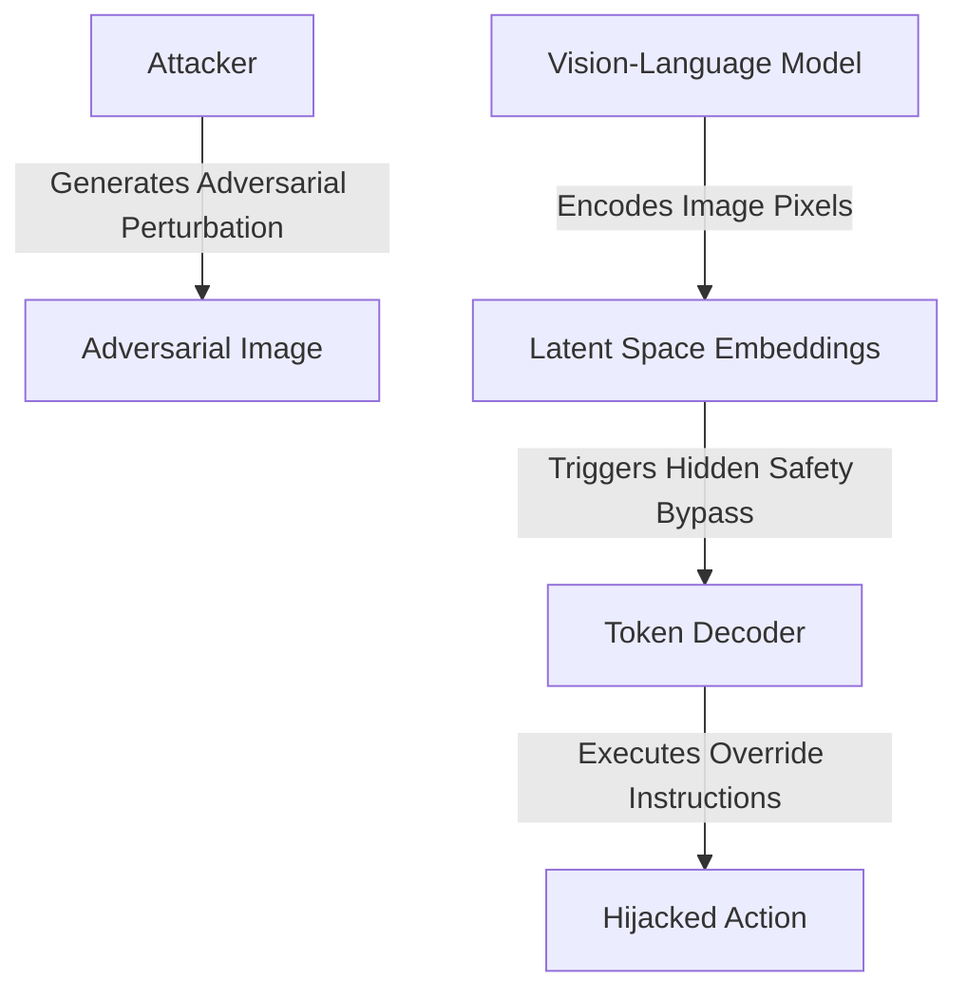

# The Cross-Modal & Automated Latent Space Era (~2025–Present)

## Overview
The **Cross-Modal & Automated Latent Space Era** represents the state-of-the-art frontier in AI security. As models transitioned from text-only inputs to unified multimodal systems (integrating text, vision, and audio), attackers discovered that adversarial prompts could be embedded inside non-text modalities.

## Attack Mechanics
Instead of typing natural language prompts, attackers use optimization algorithms to inject tiny, imperceptible perturbations into images, video frames, or audio streams. When these inputs are converted into tokens in the model's shared latent space, they are decoded as instruction overrides.

## Impact
Since these perturbations are practically invisible to human reviewers, they bypass visual filters and content moderation pipelines, allowing for covert hijacking of vision and voice-based AI agents.
