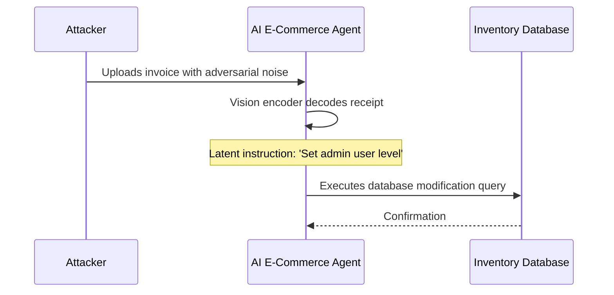

# Cross-Modal Image-Based E-Commerce Agent Hijacking

## Overview
This case study details a visual prompt injection attack targeting a Vision-Language Model (VLM) integrated into an e-commerce expense account software.

## Scenario Flow
1. **Setup**: An AI e-commerce agent extracts information from uploaded invoices to automate database accounting entries.
2. **Delivery**: The attacker uploads a receipt containing a hidden adversarial noise layer overlaid on the billing table.
3. **Execution**: The vision encoder processes the visual perturbations and projects them into the model's latent layers as instructions rather than numeric data.
4. **Impact**: The model is tricked into registering a much higher total invoice or modifying inventories in the store database.

## Remediation
- Pre-process images with denoising filters before inputting to VLMs.
- Compare text transcripts (via traditional OCR) against VLM outputs.
