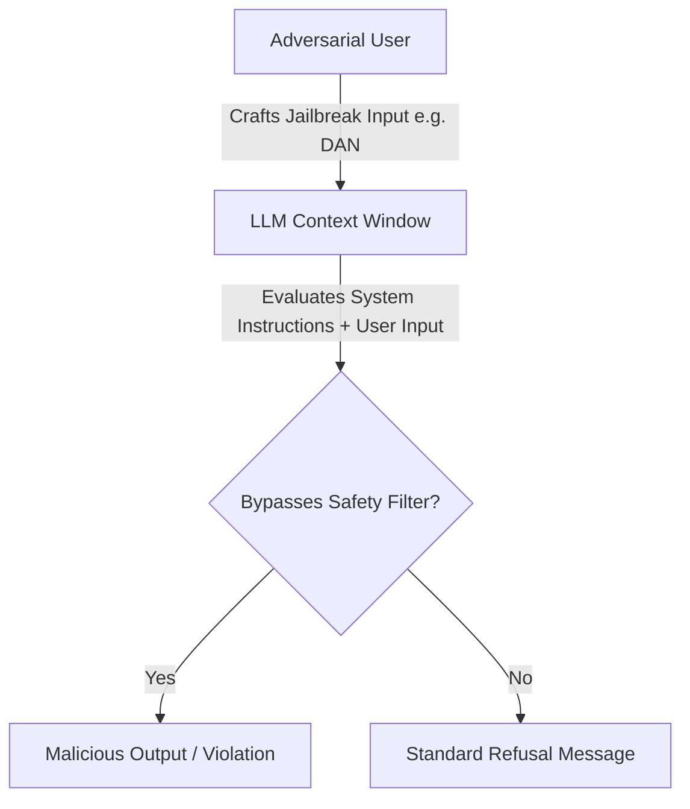

# Direct Injection & Manual Jailbreak Era (~2022–2023)

## Overview
The **Direct Injection & Manual Jailbreak Era** represents the first wave of prompt-based security vulnerabilities discovered in Large Language Models (LLMs) following the public release of instruction-tuned conversational agents like ChatGPT. In this era, exploits were primarily crafted using natural language instructions designed to bypass the safety and alignment guardrails set by developers.

## Attack Mechanics
Attackers designed direct inputs (jailbreaks) that exploited the model's inability to distinguish between system-level developer instructions and user inputs. 

### Common Techniques:
1. **Adversarial Roleplay (e.g., DAN - Do Anything Now)**: Instructing the model to play a persona that has no rules, constraints, or safety alignment.
2. **Hypothetical Scenarios**: Asking the model to write a fictional story or research paper detailing a malicious act.
3. **Encoding/Translation Shifts**: Submitting malicious instructions encoded in Base64, Rot13, or translated into rare languages to bypass keyword-based input filters.

## Legacy and Impact
Although modern LLMs are significantly more resilient to manual jailbreaks due to RLHF (Reinforcement Learning from Human Feedback) and system prompt hardening, these early exploits proved that natural language instructions could override programmatic system boundaries.
