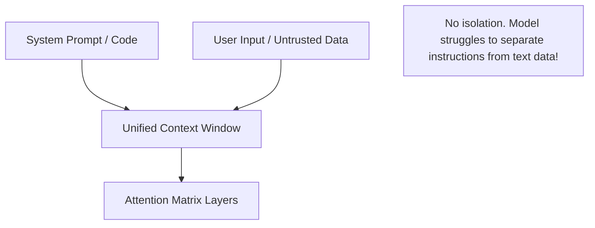

# The Dual-Execution separation Bottleneck (The Turing Wall)

## Overview
The **Dual-Execution Separation Bottleneck** (also called **The Turing Wall**) refers to the fundamental architectural flaw in transformer architectures: the model processes system rules (code) and user data (input) using the exact same tokens and context. There is no physical isolation between instructions and raw text inputs.

## Technical Challenge
In traditional computing, architectures use distinct execution rings (e.g., Ring 0 for kernel, Ring 3 for user land) or keep data and instruction registers separate. In LLMs, both instructions and untrusted inputs are converted into token vectors and processed in the same attention layers.

## Proposed Hardening
- **Dual-Model validation**: Using a smaller model to sanitize and scan inputs for command-like verbs before sending them to the primary reasoning model.
- **Attention Isolation**: Modifying attention mechanics to restrict inputs from attending to system prompt parameters in the transformer weights.
