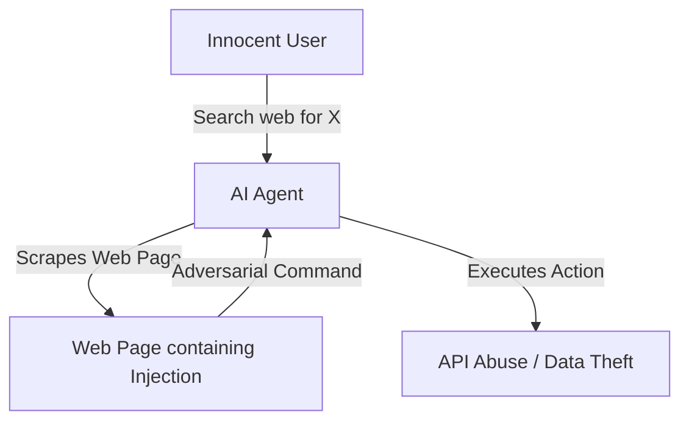

# Indirect Prompt Injection (Data-Driven Poisoning)

## Overview
**Indirect Prompt Injection** happens when a malicious payload is embedded inside a document, webpage, or email that an LLM processes as context. The user interacting with the AI is usually unaware of the attack.

## Attack Mechanics
AI agents that interact with external files or scan the web represent the main targets. When the agent pulls external information, it parses the payload as if it were a developer instruction, leading to unauthorized behavior.

## Scenarios
- Poisoned resumes triggering automated hiring systems to automatically select a candidate.
- Malicious product descriptions prompting shopping assistants to steer users to a specific site.
