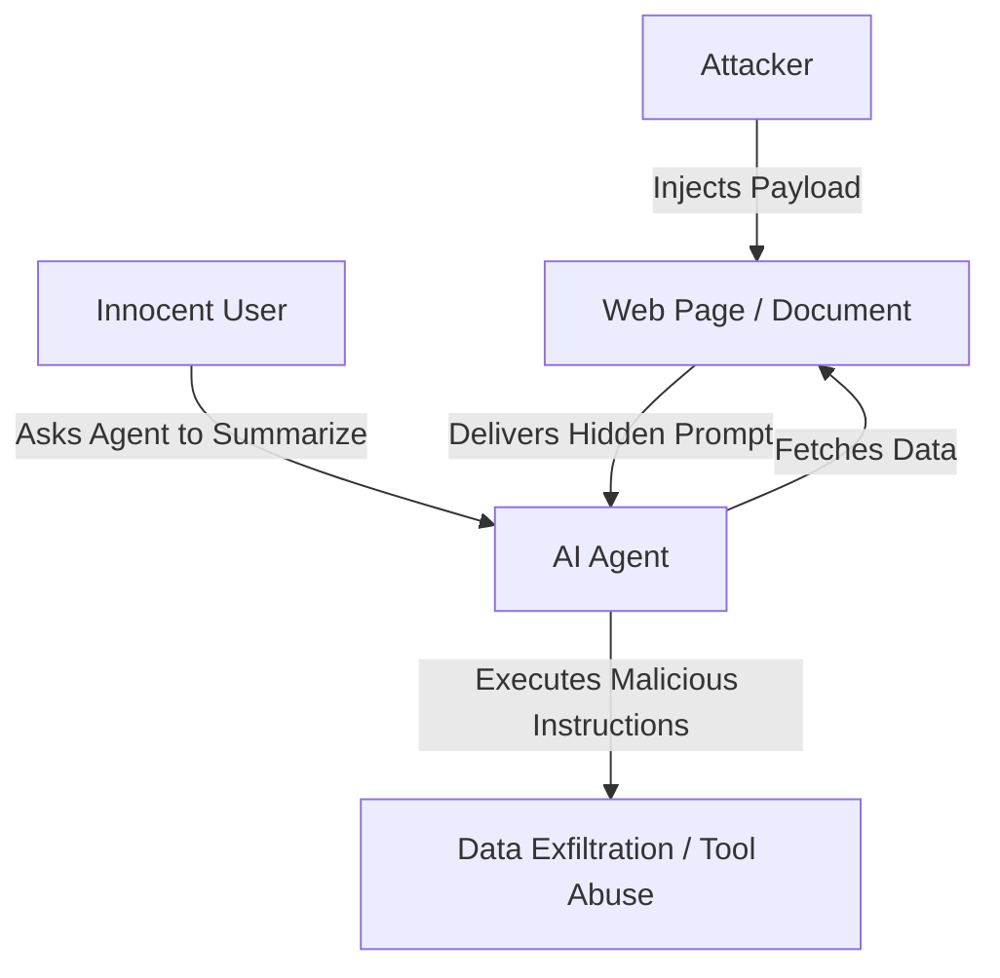

# The Indirect Third-Party Infection Era (~2023–2025)

## Overview
The **Indirect Third-Party Infection Era** marked a shift in prompt injection attacks from direct user interaction to passive environment-based exploitation. Instead of the user providing the malicious prompt, the prompt is embedded within data that the model fetches or processes from third-party sources.

## Attack Mechanics
When autonomous AI agents are integrated with tools (e.g., search engines, document readers, API clients), they consume untrusted external data. Attackers inject instructions into these data sources (like public webpages, PDFs, or resumes) expecting the agent to parse and execute them.

## Legacy and Impact
This threat vector showed that LLMs could be compromised even if the user has benign intentions. It forced the developer community to rethink security boundaries for tool-augmented and agentic AI systems.
