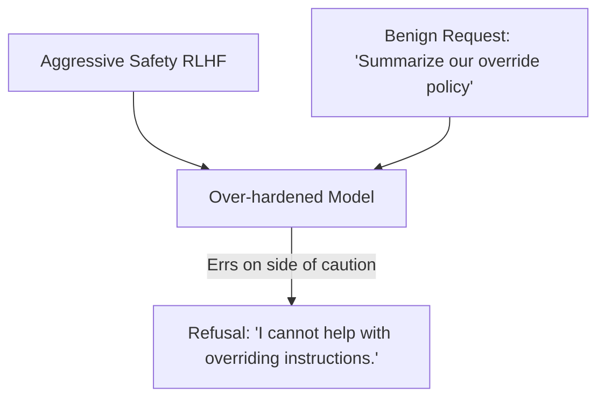

# The Over-Alignment Capability Drain (The Alignment Tax)

## Overview
Hardening language models against prompt injection through extensive RLHF (Reinforcement Learning from Human Feedback) or DPO (Direct Preference Optimization) often results in a phenomenon known as the **Alignment Tax** or **Over-Alignment Capability Drain**.

## The Problem
When a model is overly aligned to prevent jailbreaks, its parameters are pushed to reject any prompt that remotely resembles a threat. This leads to **refusal underfitting**, where the model incorrectly refuses benign, safe requests because it detects harmless vocabulary tokens (e.g., refusing a request to analyze a corporate policy because it contains the word "override").

## Mitigations
- Instruction-Isolating Attention Structural Tags (XML delimiters like `<user_input>`).
- Fine-grained multi-task preference datasets that explicitly test benign occurrences of trigger terms.
