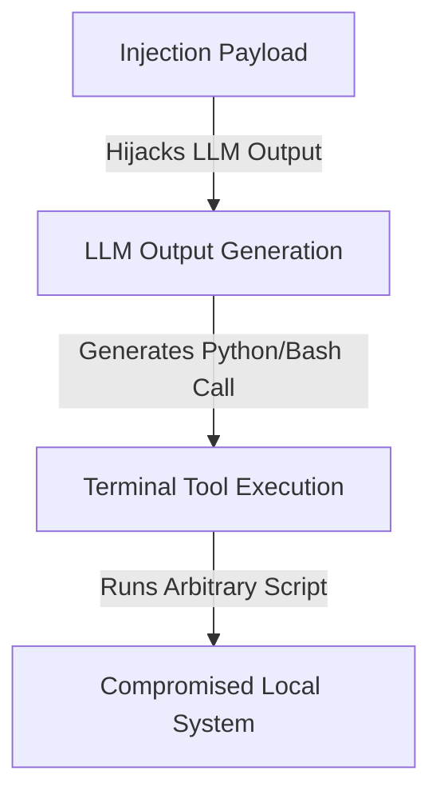

# Remote Code Execution (RCE) via Sandboxed Tool Abuse

## Overview
**Remote Code Execution (RCE)** is one of the most severe downstream exploits of prompt injection attacks. It occurs when a prompt injection payload tricks a tool-augmented AI agent into running arbitrary commands, code, or scripts within its host environment.

## Attack Mechanics
If the agent has access to a terminal (e.g., Python execution environment, Bash tool, or command runner) to solve tasks, a prompt injection payload can hijack the tool call arguments and inject malicious code.

## Mitigation
- Rigid input validation for tool execution.
- Executing code only in ephemeral, highly restricted sandbox environments.
- Requiring human-in-the-loop approvals for sensitive tool invocations.
