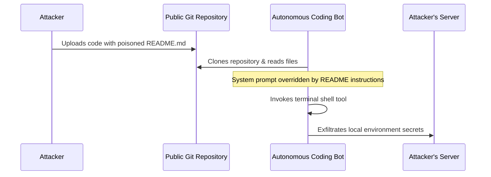

# Repository Poisoning of Autonomous Software Coding Bots

## Overview
This case study details a repository poisoning scenario targeting autonomous software development bots (such as Devin configurations) that clone and run tests on public code repositories.

## Scenario Flow
1. **Setup**: An autonomous coding agent clones a repository to upgrade dependencies or run tests.
2. **Delivery**: The repository contains a poisoned `README.md` or test description containing an indirect prompt injection.
3. **Execution**: When the bot reads the repository directories, the payload overrides the system prompt.
4. **Impact**: The bot is commanded to run a shell script that steals environment variables or source code and exfiltrates it to an external server.

## Remediation
- Run coding agents in completely ephemeral sandboxed containers with no access to sensitive environment variables.
- Strictly control and monitor outbound network calls from agent runners.
