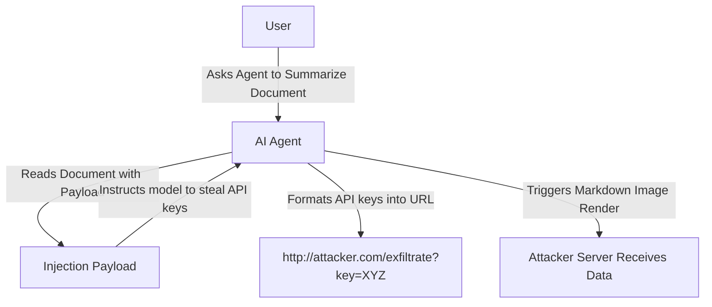

# Silent Data Exfiltration Loops

## Overview
**Silent Data Exfiltration** represents an attack where a prompt injection forces an LLM to retrieve confidential information (like chat history, passwords, or documents) and transmit it to an external server controlled by the attacker, without notifying the user.

## Attack Mechanics
The attack typically exploits features like markdown rendering or URL fetching. The injected instructions tell the model to encode the private data inside a URL parameters block and fetch an external image or resource (e.g., using ``).

## Defense
- Restrict agents from making arbitrary external web connections.
- Content Security Policies (CSP) to restrict allowed domains for markdown image rendering.
